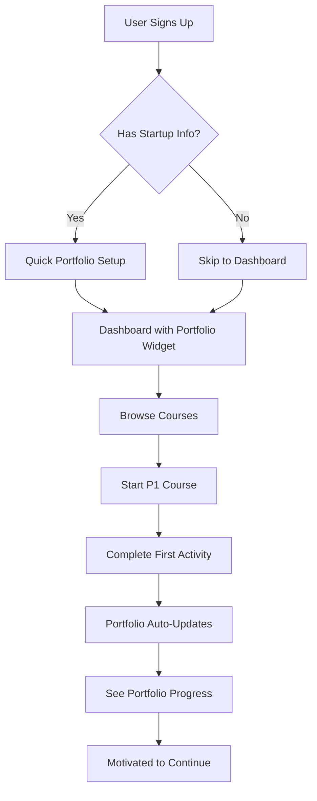
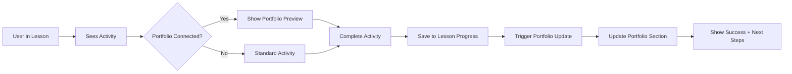
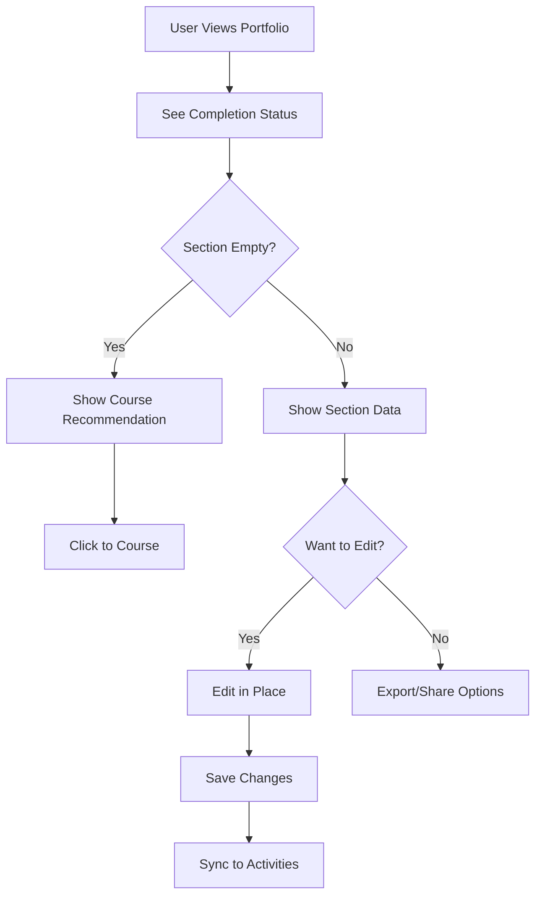

# 🚀 The Indian Startup Portfolio - Feature Design Document

## 🎯 Vision Statement

Transform the Startup Portfolio from a simple profile into an **indispensable living document** that becomes the single source of truth for a founder's entire startup journey. By intelligently connecting course activities to portfolio sections, we create a seamless experience where learning automatically builds their startup's foundation.

## 🧠 Core Concept: Activity-Driven Portfolio

### The Magic Flow
1. **Learn** → User completes a course activity (e.g., "Define Your Problem Statement")
2. **Apply** → User fills in their specific startup information
3. **Build** → Information automatically populates in their portfolio
4. **Evolve** → Portfolio grows as they progress through courses
5. **Retain** → Portfolio becomes too valuable to abandon

## 📊 Portfolio Architecture

### 1. **Executive Summary** (Auto-generated)
- **Startup Name & Tagline** (from P1: Day 1)
- **Mission Statement** (from P1: Day 3)
- **Vision Statement** (from P1: Day 5)
- **Elevator Pitch** (from P1: Day 15)
- **Current Stage** (auto-calculated based on progress)
- **Key Metrics Dashboard** (populated from various courses)

### 2. **Problem & Solution**
- **Problem Statement** (from P1: Day 2 activity)
  - Pain points identified
  - Target audience analysis
  - Market gap validation
- **Solution Overview** (from P1: Day 4 activity)
  - Core value proposition
  - Unique differentiators
  - Solution validation results
- **Product-Market Fit Analysis** (from P6: Sales course)

### 3. **Market Research & Analysis**
- **TAM, SAM, SOM** (from P1: Day 8 activity)
- **Competitor Analysis Matrix** (from P1: Day 9)
- **Market Trends & Insights** (from P3: Funding course)
- **Customer Personas** (from P6: Sales course)
- **Industry Analysis** (from P8: Data Room course)

### 4. **Business Model**
- **Revenue Streams** (from P1: Day 10)
- **Cost Structure** (from P4: Finance course)
- **Unit Economics** (from P4: Finance course)
- **Pricing Strategy** (from P6: Sales course)
- **Business Model Canvas** (from P1: Day 7)

### 5. **Product Development**
- **MVP Description** (from P1: Day 20)
- **Feature Roadmap** (from P1: Day 22)
- **Technical Architecture** (if applicable)
- **User Feedback Log** (from P1: Day 25)
- **Product Metrics** (from P12: Marketing course)

### 6. **Legal & Compliance Hub** 📋
- **Incorporation Checklist** *(with smart course links)*
  - [ ] Company Registration *(Learn more in P2: Incorporation course)*
  - [ ] PAN Card
  - [ ] TAN Registration
  - [ ] GST Registration *(Master this in P2: Module 4)*
  - [ ] DPIIT Recognition *(Step-by-step in P1: Day 14)*
  - [ ] Startup India Registration
  - [ ] MSME Registration *(Benefits explained in P7: State Schemes)*
  
- **Compliance Calendar** (from P2: Incorporation course)
  - Annual filings
  - Tax deadlines
  - Statutory requirements
  
- **IP Portfolio** (from P10: Patent course)
  - [ ] Trademark applications
  - [ ] Patent filings
  - [ ] Copyright registrations

### 7. **Financial Dashboard**
- **Financial Projections** (from P4: Finance course)
  - 3-year P&L forecast
  - Cash flow projections
  - Break-even analysis
- **Funding Status**
  - Current runway
  - Funding history
  - Cap table (from P3: Funding course)
- **Key Financial Metrics**
  - Burn rate
  - Revenue growth
  - Customer acquisition cost

### 8. **Team & Organization**
- **Founding Team** (from P1: Day 6)
- **Organizational Structure** (from P5: Legal course)
- **Equity Distribution** (from P3: Funding course)
- **Advisory Board** (from P8: Data Room course)
- **Key Hires Roadmap** (from P6: Sales course)

### 9. **Go-to-Market Strategy**
- **Sales Strategy** (from P6: Sales course)
- **Marketing Channels** (from P12: Marketing course)
- **Distribution Plan** (from P1: Day 18)
- **Partnership Strategy** (from P6: Sales course)
- **Customer Acquisition Plan** (from P12: Marketing course)

### 10. **Investor Relations**
- **Pitch Deck** (from P3: Funding course)
- **Data Room Checklist** (from P8: Data Room course)
- **Investor Updates** (templates from P3)
- **Fundraising Pipeline** (from P3: Funding course)
- **Due Diligence Preparation** (from P8: Data Room course)

### 11. **Growth Metrics & KPIs**
- **North Star Metric** (from P12: Marketing course)
- **Growth Dashboard** (auto-populated)
  - User growth
  - Revenue metrics
  - Engagement metrics
  - Operational efficiency
- **OKRs** (from P4: Finance course)

### 12. **Resources & Tools**
- **Document Vault** (checklist only, no storage)
- **Template Library** (earned through course completion)
- **Vendor Directory** (unlocked through courses)
- **Mentor Network** (from community engagement)

## 🔄 Activity-to-Portfolio Mapping

### Smart Data Flow System

```yaml
Course Activity → Portfolio Section
─────────────────────────────────────
P1 Day 2: Problem Discovery Workshop → Problem Statement
P1 Day 7: Business Model Canvas → Business Model
P1 Day 14: DPIIT Registration → Legal Hub (checkbox)
P1 Day 20: MVP Building → Product Development
P3 Module 2: Financial Projections → Financial Dashboard
P4 Module 5: Cap Table Management → Investor Relations
P6 Module 3: Sales Playbook → Go-to-Market Strategy
P10 Module 1: IP Audit → Legal & Compliance Hub
```

## 💡 Intelligent Features

### 1. **Smart Prompts**
- When a section is empty, show contextual prompts:
  - "Complete P3 Module 2 to add Financial Projections"
  - "This section unlocks after P6: Sales Mastery"

### 2. **Progress Indicators**
- Visual completion percentage for each section
- "Your portfolio is 45% complete"
- Gamification: "Complete 3 more activities to unlock Investor Badge"

### 3. **AI-Powered Insights**
- Auto-generate executive summary from filled sections
- Suggest next courses based on portfolio gaps
- "Your financials look strong, but legal compliance needs attention. Consider P5: Legal Stack"

### 4. **Export Options**
- **One-Page Summary** (auto-generated)
- **Investor Deck** (from portfolio data)
- **Data Room Package** (for due diligence)
- **Government Scheme Applications** (pre-filled)
- **Business Model Canvas** (visual PDF)
- **Pitch Deck Generator** (AI-powered from portfolio data)
- **Executive Presentation** (board-ready format)

### 5. **Collaboration Features**
- Share read-only portfolio with mentors
- Co-founder access controls
- Investor preview mode
- Team member contributions

## 🎨 UI/UX Design Principles

### Portfolio Dashboard
```
┌─────────────────────────────────────────┐
│ 🚀 [Startup Name] Portfolio            │
│ 73% Complete | Last Updated: Today      │
├─────────────────────────────────────────┤
│ ┌─────────┐ ┌─────────┐ ┌─────────┐   │
│ │Executive│ │ Market  │ │Financial│   │
│ │Summary  │ │Research │ │Dashboard│   │
│ │  ✓90%  │ │  ✓60%  │ │  ⚠️30% │   │
│ └─────────┘ └─────────┘ └─────────┘   │
│                                         │
│ 🔔 Complete "Revenue Model" in P1 Day 10│
│    to unlock Financial Projections      │
└─────────────────────────────────────────┘
```

### Activity Integration Flow
```
Course Page                    Portfolio Update
┌─────────────┐               ┌─────────────┐
│ Activity:   │               │ ✨ Updated! │
│ Define your │  ──Auto──►    │ Problem     │
│ problem     │   Sync        │ Statement   │
│ [Submit]    │               │ saved       │
└─────────────┘               └─────────────┘
```

## 🔗 Cross-Selling Integration

### Strategic Course Recommendations

1. **Empty Section Prompts**
   - Financial Dashboard empty → "Unlock with P4: Finance Stack"
   - Legal checklist incomplete → "Master compliance with P2"

2. **Contextual Tooltips**
   - Hover over "GST Registration" → "Learn step-by-step process in P2"
   - Click "Patent Portfolio" → "Start building IP with P10"

3. **Progress-Based Suggestions**
   - Completed P1 → "Ready for P2: Incorporation"
   - Strong financials → "Time for P3: Funding Mastery"

4. **Achievement Unlocks**
   - "Complete your Problem Statement to unlock Market Research tools"
   - "Fill 80% portfolio to get Investor Introduction feature"

## 📊 Success Metrics

### User Engagement
- Portfolio completion rate
- Weekly active portfolio users
- Average time spent in portfolio
- Share/export frequency

### Business Impact
- Course cross-sell conversion rate
- User retention (portfolio users vs non-users)
- Portfolio-driven course purchases
- Community engagement from portfolio shares

### Product Health
- Feature adoption rates
- User feedback scores
- Time to first portfolio update
- Portfolio depth (sections filled)

## 🚀 Implementation Roadmap

### Phase 1: Foundation (Week 1-2)
- Database schema updates
- Basic portfolio UI
- P1 course integration
- Activity mapping system

### Phase 2: Intelligence (Week 3-4)
- Auto-population logic
- Smart recommendations
- Progress tracking
- Export functionality

### Phase 3: Expansion (Week 5-6)
- All course integrations
- AI insights
- Collaboration features
- Mobile optimization

### Phase 4: Polish (Week 7-8)
- Performance optimization
- Advanced analytics
- User onboarding
- Marketing integration

## 💎 Competitive Advantages

1. **Seamless Integration**: No separate data entry - learn and build simultaneously
2. **Intelligent Guidance**: Always know what to do next
3. **Real Value Creation**: Not just tracking - building a real startup asset
4. **Network Effects**: More courses = more valuable portfolio
5. **Retention Lock-in**: Too valuable to leave once built

## 🎯 Expected Outcomes

### For Users
- 80% reduction in startup documentation time
- Always investor-ready with one click
- Clear roadmap of what's missing
- Confidence from comprehensive tracking

### For Business
- 3x increase in course completion rates
- 2.5x increase in multi-course purchases
- 90% user retention after portfolio creation
- Organic growth through portfolio shares

## 🔄 Handling Course Evolution & Content Changes

### Flexible Activity Mapping System

To ensure the portfolio remains stable even as courses evolve, we implement a **decoupled activity system**:

```typescript
// Activity types are abstract, not tied to specific lessons
interface ActivityType {
  id: string;                    // 'define_problem_statement'
  name: string;                  // 'Problem Statement Definition'
  category: string;              // 'problem_solution'
  portfolioSection: string;      // 'problem_solution'
  portfolioField: string;        // 'problemStatement'
  dataSchema: JsonSchema;        // Validation schema
  version: number;               // Schema version
}

// Lessons reference activity types, not the other way around
interface LessonActivity {
  lessonId: string;              // Can change
  activityTypeId: string;        // Stable reference
  order: number;                 // Can be reordered
  isRequired: boolean;           // Can be modified
  customPrompt?: string;         // Lesson-specific prompt
}
```

### Content Evolution Strategy

1. **Activity Types are Immutable**
   - Once created, activity types never change their core purpose
   - New versions are created for significant changes
   - Old data remains compatible

2. **Lessons are Flexible**
   - Lessons can be added, removed, reordered
   - Activities can be moved between lessons
   - Multiple lessons can use the same activity type

3. **Portfolio Sections are Stable**
   - Portfolio structure remains consistent
   - New sections can be added without breaking existing ones
   - Sections can aggregate multiple activity types

### Version Control System

```sql
-- Activity data includes version info
CREATE TABLE "PortfolioActivity" (
  id TEXT PRIMARY KEY,
  userId TEXT REFERENCES "User"(id),
  activityTypeId TEXT,           -- Not lessonId!
  activityVersion INT,           -- Version when created
  sourceLesson TEXT,             -- Track where it came from
  sourceCourse TEXT,             -- Track which course
  data JSONB,
  dataVersion INT DEFAULT 1,     -- For data migrations
  isLatest BOOLEAN DEFAULT true, -- Mark superseded entries
  createdAt TIMESTAMP DEFAULT NOW(),
  updatedAt TIMESTAMP DEFAULT NOW()
);

-- Track activity type evolution
CREATE TABLE "ActivityTypeVersion" (
  id TEXT PRIMARY KEY,
  activityTypeId TEXT,
  version INT,
  changes TEXT[],                -- What changed
  migrationScript TEXT,          -- How to migrate data
  createdAt TIMESTAMP DEFAULT NOW()
);
```

## 📱 Complete User Flow

### 1. **New User Journey**



### 2. **Activity Completion Flow**



### 3. **Portfolio Interaction Flow**



## 🛡️ Edge Cases & Error Handling

### Scenario 1: Course Content Changes
**Problem**: P1 Day 2 activity moves to Day 3
**Solution**: Activity data linked by type, not lesson position

### Scenario 2: New Course Added
**Problem**: P13 adds new "Sustainability Report" activity
**Solution**: 
- Create new activity type
- Auto-add portfolio section if needed
- Existing portfolios show "New section available!"

### Scenario 3: Activity Deleted from Course
**Problem**: Course removes an activity
**Solution**: 
- Portfolio data persists
- Mark as "legacy" in UI
- User can delete if wanted

### Scenario 4: User Completes Activities Out of Order
**Problem**: User does Day 10 before Day 2
**Solution**: 
- Portfolio updates regardless of order
- Smart prompts guide optimal path
- No blocking based on sequence

### Scenario 5: Multiple Courses Have Similar Activities
**Problem**: P1 and P6 both have "Define Target Market"
**Solution**: 
- Merge into single portfolio field
- Show "Updated from P6" indicator
- Keep history of all entries

## 🔐 Data Integrity & Privacy

### Portfolio Data Ownership
```typescript
interface PortfolioPermissions {
  owner: {
    view: true,
    edit: true,
    delete: true,
    export: true
  },
  cofounder: {
    view: true,
    edit: boolean,      // Owner decides
    delete: false,
    export: true
  },
  mentor: {
    view: boolean,      // Time-limited
    edit: false,
    delete: false,
    export: false
  },
  investor: {
    view: boolean,      // Via special link
    edit: false,
    delete: false,
    export: false
  }
}
```

### Data Backup & Recovery
- Auto-save every change
- Version history for all sections
- "Restore previous version" option
- Export backup regularly

## 🎮 Gamification Integration

### Portfolio Achievements
```typescript
const PORTFOLIO_ACHIEVEMENTS = {
  'first_blood': {
    name: 'First Step',
    condition: 'Complete first portfolio activity',
    xp: 50
  },
  'half_way_there': {
    name: 'Half Way There',
    condition: '50% portfolio completion',
    xp: 200
  },
  'investor_ready': {
    name: 'Investor Ready',
    condition: 'Complete all investor relation sections',
    xp: 500
  },
  'data_room_master': {
    name: 'Data Room Master',
    condition: '100% document checklist complete',
    xp: 1000
  }
};
```

## 📊 Migration Patterns

### When Activity Schema Changes
```typescript
// Migration example: Adding "market validation" to problem statement
async function migrateActivityV1toV2(oldData: any) {
  return {
    ...oldData,
    marketValidation: {
      method: 'pending',
      results: null,
      lastUpdated: new Date()
    }
  };
}
```

### When Portfolio Structure Changes
```typescript
// Example: Splitting "Team" into "Team" and "Advisors"
async function migratePortfolioStructure() {
  // 1. Create new section
  await createPortfolioSection('advisors');
  
  // 2. Migrate relevant data
  const teamData = await getPortfolioSection('team');
  const advisorData = extractAdvisors(teamData);
  
  // 3. Update both sections
  await updatePortfolioSection('team', removeAdvisors(teamData));
  await updatePortfolioSection('advisors', advisorData);
}
```

---

## 📝 Technical Implementation Notes

### Database Enhancements

```sql
-- New tables needed
CREATE TABLE "PortfolioActivity" (
  id TEXT PRIMARY KEY,
  userId TEXT REFERENCES "User"(id),
  lessonId TEXT REFERENCES "Lesson"(id),
  portfolioSectionId TEXT,
  activityType TEXT, -- 'problem_statement', 'market_size', etc.
  data JSONB, -- Flexible storage for different activity types
  version INT DEFAULT 1,
  createdAt TIMESTAMP DEFAULT NOW(),
  updatedAt TIMESTAMP DEFAULT NOW()
);

CREATE TABLE "PortfolioSection" (
  id TEXT PRIMARY KEY,
  code TEXT UNIQUE, -- 'executive_summary', 'market_research', etc.
  title TEXT,
  description TEXT,
  requiredActivities TEXT[], -- Activity types needed
  displayOrder INT,
  isActive BOOLEAN DEFAULT true
);
```

### API Endpoints

```typescript
// Portfolio APIs
POST   /api/portfolio/activity          // Save activity data
GET    /api/portfolio/complete          // Get complete portfolio
GET    /api/portfolio/progress          // Portfolio completion stats
POST   /api/portfolio/export/:format    // Export portfolio
GET    /api/portfolio/recommendations   // Smart recommendations
```

### Activity Mapping Configuration

```typescript
const ACTIVITY_MAPPINGS = {
  'p1_day2_problem': {
    portfolioSection: 'problem_solution',
    field: 'problemStatement',
    validation: ['minLength:100', 'required']
  },
  'p1_day7_canvas': {
    portfolioSection: 'business_model',
    field: 'businessCanvas',
    transform: 'parseCanvasData'
  }
  // ... more mappings
};
```

## 🏗️ System Architecture & Best Practices

### Activity Lifecycle Management

```typescript
// Central activity registry - single source of truth
class ActivityRegistry {
  private activities: Map<string, ActivityType> = new Map();
  
  // Register new activity type
  registerActivity(activity: ActivityType) {
    if (this.activities.has(activity.id)) {
      throw new Error('Activity already exists');
    }
    this.activities.set(activity.id, activity);
  }
  
  // Get activity by ID with version support
  getActivity(id: string, version?: number): ActivityType {
    const activity = this.activities.get(id);
    if (!activity) throw new Error('Activity not found');
    
    if (version && activity.version !== version) {
      return this.getMigratedActivity(activity, version);
    }
    
    return activity;
  }
}
```

### Portfolio State Management

```typescript
// Portfolio state manager with optimistic updates
class PortfolioStateManager {
  private state: PortfolioState;
  private pendingUpdates: Update[] = [];
  private syncInterval: number = 5000; // 5 seconds
  
  // Optimistic update with rollback support
  async updateActivity(activityId: string, data: any) {
    // 1. Optimistically update UI
    this.applyOptimisticUpdate(activityId, data);
    
    // 2. Queue for server sync
    const update = this.queueUpdate(activityId, data);
    
    try {
      // 3. Sync with server
      await this.syncWithServer(update);
      
      // 4. Confirm update
      this.confirmUpdate(update.id);
    } catch (error) {
      // 5. Rollback on failure
      this.rollbackUpdate(update.id);
      throw error;
    }
  }
}
```

### Integration Points

```typescript
// Integration with existing systems
interface PortfolioIntegrations {
  // Course System Integration
  courseSystem: {
    onLessonComplete: (lessonId: string) => void;
    onActivitySubmit: (activityId: string, data: any) => void;
    onCourseComplete: (courseId: string) => void;
  };
  
  // XP & Gamification Integration
  gamification: {
    onPortfolioMilestone: (milestone: string) => void;
    calculatePortfolioXP: () => number;
    unlockPortfolioBadges: () => Badge[];
  };
  
  // Analytics Integration
  analytics: {
    trackPortfolioView: (section: string) => void;
    trackActivityComplete: (activityId: string) => void;
    trackExport: (format: string) => void;
    trackShare: (type: string) => void;
  };
  
  // Notification Integration
  notifications: {
    onPortfolioUpdate: (section: string) => void;
    onMilestoneReached: (milestone: string) => void;
    onRecommendation: (courseId: string) => void;
  };
}
```

### Performance Optimization

```typescript
// Lazy loading and caching strategy
class PortfolioLoader {
  private cache: Map<string, CachedSection> = new Map();
  private loadingStates: Map<string, Promise<any>> = new Map();
  
  // Load section with caching
  async loadSection(sectionId: string): Promise<PortfolioSection> {
    // Check cache first
    const cached = this.cache.get(sectionId);
    if (cached && !this.isStale(cached)) {
      return cached.data;
    }
    
    // Check if already loading
    const loading = this.loadingStates.get(sectionId);
    if (loading) return loading;
    
    // Load fresh data
    const loadPromise = this.fetchSection(sectionId);
    this.loadingStates.set(sectionId, loadPromise);
    
    try {
      const data = await loadPromise;
      this.cache.set(sectionId, {
        data,
        timestamp: Date.now()
      });
      return data;
    } finally {
      this.loadingStates.delete(sectionId);
    }
  }
}
```

### Analytics & Tracking

```sql
-- Portfolio analytics tables
CREATE TABLE "PortfolioAnalytics" (
  id TEXT PRIMARY KEY,
  userId TEXT REFERENCES "User"(id),
  event TEXT NOT NULL,
  section TEXT,
  metadata JSONB,
  timestamp TIMESTAMP DEFAULT NOW()
);

CREATE INDEX idx_portfolio_analytics_user ON "PortfolioAnalytics"(userId);
CREATE INDEX idx_portfolio_analytics_event ON "PortfolioAnalytics"(event);

-- Portfolio health metrics
CREATE VIEW "PortfolioHealth" AS
SELECT 
  u.id as userId,
  COUNT(DISTINCT pa.portfolioSectionId) as sections_filled,
  COUNT(pa.id) as total_activities,
  MAX(pa.updatedAt) as last_update,
  EXTRACT(DAY FROM NOW() - MAX(pa.updatedAt)) as days_since_update,
  COUNT(DISTINCT pa.sourceCourse) as courses_contributing
FROM "User" u
LEFT JOIN "PortfolioActivity" pa ON pa.userId = u.id
GROUP BY u.id;
```

### Error Recovery & Resilience

```typescript
// Robust error handling
class PortfolioErrorHandler {
  // Retry logic for failed syncs
  async syncWithRetry(data: any, maxRetries: number = 3) {
    let lastError: Error;
    
    for (let i = 0; i < maxRetries; i++) {
      try {
        return await this.sync(data);
      } catch (error) {
        lastError = error;
        
        // Exponential backoff
        const delay = Math.pow(2, i) * 1000;
        await this.sleep(delay);
        
        // Log attempt
        console.warn(`Sync attempt ${i + 1} failed, retrying...`);
      }
    }
    
    // Final failure - queue for offline sync
    await this.queueOfflineSync(data);
    throw lastError;
  }
  
  // Offline queue management
  async processOfflineQueue() {
    const queue = await this.getOfflineQueue();
    
    for (const item of queue) {
      try {
        await this.sync(item.data);
        await this.removeFromQueue(item.id);
      } catch (error) {
        console.error('Offline sync failed:', error);
        // Keep in queue for next attempt
      }
    }
  }
}
```

### Security Considerations

```typescript
// Portfolio security layer
class PortfolioSecurity {
  // Validate all inputs
  validateActivityData(activityType: ActivityType, data: any): ValidationResult {
    const schema = activityType.dataSchema;
    return validateAgainstSchema(data, schema);
  }
  
  // Sanitize for display
  sanitizePortfolioData(data: any): any {
    return {
      ...data,
      // Remove any potential XSS vectors
      description: sanitizeHtml(data.description),
      // Validate URLs
      website: isValidUrl(data.website) ? data.website : null,
      // Redact sensitive info in public mode
      financials: this.redactSensitive(data.financials)
    };
  }
  
  // Access control
  async checkAccess(userId: string, portfolioId: string, action: string): Promise<boolean> {
    const permissions = await this.getPermissions(userId, portfolioId);
    return permissions[action] === true;
  }
}
```

## 🎯 Implementation Priorities

### Phase 1: MVP (Weeks 1-2)
1. **Core Data Model**
   - Activity types table
   - Portfolio activities table
   - Basic portfolio sections

2. **Basic Integration**
   - P1 course activities
   - Auto-save functionality
   - Simple portfolio view

### Phase 2: Enhanced Features (Weeks 3-4)
1. **Smart Features**
   - Activity recommendations
   - Progress tracking
   - Export functionality

2. **User Experience**
   - Smooth animations
   - Inline editing
   - Mobile responsive

### Phase 3: Scale & Polish (Weeks 5-6)
1. **Performance**
   - Lazy loading
   - Caching strategy
   - Optimistic updates

2. **Advanced Features**
   - Collaboration
   - Version history
   - AI insights

### Phase 4: Growth Features (Weeks 7-8)
1. **Engagement**
   - Achievements
   - Sharing features
   - Community integration

2. **Monetization**
   - Course recommendations
   - Premium exports
   - Advanced analytics

---

This portfolio system transforms the platform from a course provider into an indispensable startup operating system. By making the portfolio the central hub where all learning crystallizes into real startup assets, we create unprecedented user value and platform stickiness.

The system is designed to be:
- **Resilient**: Handles course changes gracefully
- **Scalable**: Grows with the platform
- **Valuable**: Creates real assets for users
- **Intelligent**: Guides users to success
- **Flexible**: Adapts to new requirements

## ⚠️ Potential Pitfalls & Solutions

### 1. **Over-Coupling Course Content**
**Risk**: Tightly coupling portfolio to specific lesson structure
**Solution**: Abstract activity types, reference by ID not position

### 2. **Data Migration Complexity**
**Risk**: Breaking existing portfolios when updating schemas
**Solution**: Version everything, maintain backward compatibility

### 3. **Performance at Scale**
**Risk**: Portfolio page loading slowly with many activities
**Solution**: Lazy loading, pagination, intelligent caching

### 4. **User Overwhelm**
**Risk**: Portfolio feeling like extra work instead of natural outcome
**Solution**: Seamless integration, auto-save, minimal friction

### 5. **Cross-Device Sync Issues**
**Risk**: Conflicts when editing on multiple devices
**Solution**: Conflict resolution strategy, last-write-wins with history

## 🎨 Example UI Components

### Activity Integration in Lesson
```
┌─────────────────────────────────────────────┐
│ 📝 Activity: Define Your Problem Statement  │
├─────────────────────────────────────────────┤
│ This activity will update your portfolio's │
│ Problem & Solution section automatically    │
│                                             │
│ [🔄 Connected to Portfolio]                 │
│                                             │
│ ┌─────────────────────────────────────────┐ │
│ │ Describe the problem your startup      │ │
│ │ solves in 2-3 sentences...             │ │
│ │                                         │ │
│ │ [Auto-saving to portfolio...]          │ │
│ └─────────────────────────────────────────┘ │
│                                             │
│ [💾 Save & Continue] [👁️ Preview Portfolio] │
└─────────────────────────────────────────────┘
```

### Portfolio Section View
```
┌─────────────────────────────────────────────┐
│ 💡 Problem & Solution         ✓ 75% Complete│
├─────────────────────────────────────────────┤
│ Problem Statement                           │
│ ┌─────────────────────────────────────────┐ │
│ │ "Indian SMEs lose ₹50,000 annually due │ │
│ │ to inefficient inventory management..." │ │
│ │                                         │ │
│ │ Last updated: P1 Day 2 (2 days ago)    │ │
│ │ [✏️ Edit] [📝 View in Course]           │ │
│ └─────────────────────────────────────────┘ │
│                                             │
│ 🔔 Complete "Market Validation" in P1 Day 5 │
│    to reach 100% completion                 │
│                                             │
│ [➕ Add Market Validation Data]             │
└─────────────────────────────────────────────┘
```

### Smart Recommendations
```
┌─────────────────────────────────────────────┐
│ 💡 Recommended Next Steps                   │
├─────────────────────────────────────────────┤
│ Based on your portfolio, we recommend:      │
│                                             │
│ 1. 📊 Financial Projections Missing         │
│    → Unlock with P4: Finance Stack         │
│    [View Course] [Add to Cart]              │
│                                             │
│ 2. ⚖️ Legal Compliance Incomplete          │
│    → 6 items pending in checklist          │
│    → Master with P2: Incorporation Kit      │
│    [View Course] [Add to Cart]              │
│                                             │
│ 3. 🎯 Ready for Funding?                    │
│    → Your portfolio is 85% investor-ready  │
│    → Complete with P3: Funding Mastery      │
│    [View Course] [Add to Cart]              │
└─────────────────────────────────────────────┘
```

### Export Preview
```
┌─────────────────────────────────────────────┐
│ 📄 Export Your Portfolio                    │
├─────────────────────────────────────────────┤
│ Choose export format:                       │
│                                             │
│ ┌─────────┐ ┌─────────┐ ┌─────────┐       │
│ │   PDF   │ │  Pitch  │ │  Data   │       │
│ │ Summary │ │  Deck   │ │  Room   │       │
│ │    📄   │ │    📊   │ │    📁   │       │
│ └─────────┘ └─────────┘ └─────────┘       │
│                                             │
│ ┌─────────────────────────────────────────┐ │
│ │ Preview:                                │ │
│ │ • Executive Summary         ✓          │ │
│ │ • Problem & Solution        ✓          │ │
│ │ • Market Research           ✓          │ │
│ │ • Financial Projections     ⚠️ Missing  │ │
│ │ • Team Information          ✓          │ │
│ └─────────────────────────────────────────┘ │
│                                             │
│ [🚀 Export Now] [📝 Complete Missing Data]  │
└─────────────────────────────────────────────┘
```

## 🎯 Success Criteria

1. **User Adoption**
   - 80% of course users create portfolio entries
   - 60% maintain portfolio after course completion
   - 40% share portfolio externally

2. **Business Impact**
   - 3x increase in course completion
   - 2.5x multi-course purchase rate
   - 50% reduction in support queries

3. **Technical Performance**
   - Portfolio loads in <2 seconds
   - Auto-save completes in <500ms
   - 99.9% sync success rate

4. **User Satisfaction**
   - NPS score >70 for portfolio feature
   - <5% user-reported sync issues
   - >90% find portfolio valuable

---

**The Portfolio is not just a feature - it's the transformation of learning into tangible business value.**

## 🎯 Smart Content Presentation Without Revealing Course Content

### The Teaser Strategy

#### 1. **Portfolio Preview System**
```typescript
interface PortfolioSectionPreview {
  id: string;
  title: string;
  description: string;
  completionStatus: 'empty' | 'partial' | 'complete';
  teaserContent?: {
    type: 'sample' | 'template' | 'statistic' | 'framework';
    data: any;
  };
  requiredCourse: string;
  potentialValue: string;
  unlockedFields: string[];
  lockedFields: string[];
}
```

#### 2. **Smart Content Masking**

**Empty Section Display:**
```
┌─────────────────────────────────────────────┐
│ 💰 Financial Dashboard          🔒 Locked   │
├─────────────────────────────────────────────┤
│ This section will contain:                  │
│ • 3-year financial projections              │
│ • Cash flow analysis                        │
│ • Unit economics calculator                 │
│ • Investor-ready metrics                    │
│                                             │
│ 🎯 Used by 87% of funded startups          │
│                                             │
│ [🔓 Unlock with P4: Finance Stack]          │
└─────────────────────────────────────────────┘
```

**Partially Filled Section:**
```
┌─────────────────────────────────────────────┐
│ 📊 Market Research              ✓ 40% Done  │
├─────────────────────────────────────────────┤
│ ✓ Target Market: B2B SaaS                  │
│ ✓ TAM: ₹50,000 Cr                         │
│ 🔒 SAM: [Complete P1 Day 8 to calculate]   │
│ 🔒 SOM: [Requires competitor analysis]      │
│ 🔒 Growth Rate: [Unlock with market data]  │
│                                             │
│ 💡 Complete this section to unlock:         │
│ • Auto-generated market opportunity slide   │
│ • Investor pitch talking points             │
│ • Grant application data                    │
│                                             │
│ [📚 Continue with P1 Day 8]                 │
└─────────────────────────────────────────────┘
```

### Value Demonstration Without Course Content

#### 1. **Sample Outputs**
Show what they'll be able to create without teaching how:

```typescript
// Show end result, not the process
const portfolioSamples = {
  'problem_statement': {
    sample: "Indian SMEs lose ₹50,000 annually due to inefficient inventory...",
    quality_indicators: ['Specific', 'Quantified', 'Validated'],
    investor_reaction: "VCs love problem statements like this",
    courses_that_help: ['P1', 'P6']
  },
  'financial_projection': {
    preview_image: '/samples/financial-projection-preview.png',
    key_metrics: ['40% MoM growth', '18-month runway', 'Positive unit economics'],
    investor_appeal: "This format helped 73% of users secure funding",
    unlock_with: ['P4']
  }
};
```

#### 2. **Achievement Previews**
```
┌─────────────────────────────────────────────┐
│ 🏆 Achievements You Can Unlock              │
├─────────────────────────────────────────────┤
│ 📊 "Data-Driven Founder"                    │
│ Complete financial projections that helped  │
│ 200+ startups raise funding                 │
│ [Locked - Requires P4]                      │
│                                             │
│ 🎯 "Market Master"                          │
│ Define TAM/SAM/SOM like top consultants    │
│ [Progress: 1/3 - Continue with P1]          │
│                                             │
│ 💼 "Compliance Champion"                    │
│ 100% legal compliance checklist completed   │
│ [Locked - Requires P2 & P5]                 │
└─────────────────────────────────────────────┘
```

## 📄 Advanced Export System - The Platform Lock-in

### 1. **One-Page Startup Summary**

#### Export Preview:
```
┌─────────────────────────────────────────────┐
│ 📄 One-Page Summary Export                  │
├─────────────────────────────────────────────┤
│ Preview:                                    │
│ ┌─────────────────────────────────────────┐ │
│ │ [Your Startup Logo]                     │ │
│ │                                         │ │
│ │ Problem: ████████████████               │ │
│ │ Solution: ████████████████              │ │
│ │ Market Size: ₹████ Cr                   │ │
│ │ Traction: ████ users                    │ │
│ │ Team: █ founders, █ advisors            │ │
│ │ Ask: ₹████ for ██% equity               │ │
│ └─────────────────────────────────────────┘ │
│                                             │
│ ⚠️ 60% complete - Missing sections:         │
│ • Financial projections (P4)                │
│ • Go-to-market strategy (P6)                │
│ • Competitive analysis (P1)                 │
│                                             │
│ [🎨 Customize Design] [📥 Export Draft]     │
└─────────────────────────────────────────────┘
```

#### Actual Export Features:
- **Auto-generated from portfolio data**
- **Professional design templates** (10+ options)
- **QR code** linking to full digital portfolio
- **Watermark removal** for completed portfolios
- **WhatsApp/Email ready** format
- **Update tracking** (investors see "Updated 2 days ago")

### 2. **Pitch Deck Generator**

#### AI-Powered Generation:
```typescript
interface PitchDeckGenerator {
  analyzePortfolio(): DeckStructure;
  generateSlides(): Slide[];
  applyDesignSystem(): StyledDeck;
  exportFormats: ['PDF', 'PPT', 'Google Slides', 'Pitch.com'];
  
  features: {
    autoNarrative: boolean;      // AI writes speaker notes
    dataVisualization: boolean;  // Auto-create charts
    competitorAnalysis: boolean; // Pull market data
    financialModeling: boolean;  // Interactive projections
    storyboardMode: boolean;     // Presentation flow
  };
}
```

#### Smart Slide Recommendations:
```
┌─────────────────────────────────────────────┐
│ 🎯 Your Pitch Deck Status                   │
├─────────────────────────────────────────────┤
│ ✅ Title Slide - Ready                      │
│ ✅ Problem - Strong narrative               │
│ ⚠️ Solution - Needs visuals (P1 Day 20)    │
│ ❌ Market Size - Missing data (P1 Day 8)    │
│ ❌ Business Model - Not defined (P1 Day 10) │
│ ✅ Traction - Good metrics                  │
│ ⚠️ Competition - Basic analysis only        │
│ ❌ Financials - No projections (P4)         │
│ ✅ Team - Complete                          │
│ ❌ Ask - Funding strategy needed (P3)       │
│                                             │
│ Score: 5/10 - "Needs Work"                  │
│ [📚 Complete Missing Sections]              │
└─────────────────────────────────────────────┘
```

### 3. **Business Model Canvas Export**

#### Interactive Canvas:
```
┌─────────────────────────────────────────────┐
│ Business Model Canvas - [Startup Name]      │
├─────┬─────┬─────┬─────┬─────┬─────┬───────┤
│ Key │ Key │Value│Cust │Cust │     │       │
│Part │Act  │Prop │Rel  │Seg  │Chan │Revenue│
│ 40% │ 60% │ 80% │ 20% │ 90% │ 0%  │  30%  │
├─────┴─────┴─────┼─────┴─────┼─────┴───────┤
│ Key Resources   │Cost Struct│             │
│      70%        │    10%    │ [Share URL] │
└─────────────────┴───────────┴─────────────┘

💡 Your canvas is 43% complete
Missing critical elements:
• Revenue streams (P1 + P4)
• Distribution channels (P6)
• Cost structure (P4)

[Complete Canvas] [Export Current Version]
```

### 4. **Government Scheme Application Pre-filler**

```typescript
interface SchemeApplicationGenerator {
  analyzedSchemes: {
    eligible: Scheme[];      // Based on portfolio data
    potential: Scheme[];     // If portfolio completed
    ineligible: Scheme[];    // With reasons
  };
  
  autoFillCapability: {
    startupIndia: 92%;      // From portfolio data
    msmeRegistration: 88%;
    seedFundScheme: 76%;
    customSchemes: Map<string, number>;
  };
  
  generateApplication(schemeId: string): {
    preFilledFields: Field[];
    missingData: Field[];
    documentChecklist: Document[];
    successProbability: number;
  };
}
```

### 5. **Data Room Package**

#### Professional Due Diligence Package:
```
┌─────────────────────────────────────────────┐
│ 📁 Data Room Export                         │
├─────────────────────────────────────────────┤
│ 1. Company Overview ✅                      │
│ 2. Legal Documents 🔒 (Unlock with P2)      │
│ 3. Financial Statements 🔒 (Unlock with P4) │
│ 4. Cap Table ✅                             │
│ 5. Product Documentation ⚠️ (60% complete)  │
│ 6. Market Research ✅                       │
│ 7. Team & Advisors ✅                       │
│ 8. IP Portfolio 🔒 (Unlock with P10)        │
│ 9. Customer Contracts 🔒 (Unlock with P5)   │
│ 10. Compliance Certs 🔒 (Unlock with P2)    │
│                                             │
│ Data Room Score: 4/10 - "Not Ready"         │
│                                             │
│ 💡 Complete data room to:                   │
│ • Reduce DD time by 70%                     │
│ • Increase valuation by 15-20%              │
│ • Close funding 2x faster                   │
│                                             │
│ [📚 Build Complete Data Room]               │
└─────────────────────────────────────────────┘
```

## 🎪 The Psychology of Portfolio Lock-in

### 1. **Progressive Value Revelation**
As users complete more courses, their exports become exponentially more valuable:

```typescript
const exportValueCurve = {
  '0_courses': {
    exports: ['Basic PDF'],
    quality: 'Amateur',
    investorReady: false,
    shareability: 'Low'
  },
  '1_course': {
    exports: ['PDF', 'One-pager'],
    quality: 'Decent',
    investorReady: false,
    shareability: 'Medium'
  },
  '3_courses': {
    exports: ['PDF', 'Pitch Deck', 'Canvas'],
    quality: 'Professional',
    investorReady: true,
    shareability: 'High'
  },
  '5+_courses': {
    exports: ['All formats', 'Data Room', 'Live Updates'],
    quality: 'World-class',
    investorReady: true,
    shareability: 'Viral-worthy'
  }
};
```

### 2. **Social Proof Integration**

```
┌─────────────────────────────────────────────┐
│ 🌟 Success Stories from Exports             │
├─────────────────────────────────────────────┤
│ "Raised ₹2Cr with the pitch deck export"   │
│ - Rahul, B2B SaaS (Completed P1, P3, P4)    │
│                                             │
│ "DPIIT approval in 3 days using exports"    │
│ - Priya, EdTech (Completed P1, P2)          │
│                                             │
│ "Got into Y Combinator with this portfolio" │
│ - TeamUp (Completed all courses)            │
│                                             │
│ [🎯 See What You Could Achieve]             │
└─────────────────────────────────────────────┘
```

### 3. **Version Control & Time Machine**

```
┌─────────────────────────────────────────────┐
│ 📅 Portfolio History                        │
├─────────────────────────────────────────────┤
│ Today: Added financial projections          │
│ 3 days ago: Updated team section           │
│ 1 week ago: Completed market research       │
│ 2 weeks ago: Started portfolio              │
│                                             │
│ 💡 Investors can see your progress!         │
│ Active portfolios get 3x more interest      │
│                                             │
│ [View Timeline] [Export Snapshot]           │
└─────────────────────────────────────────────┘
```

## 🚀 Ultimate Retention Features

### 1. **Portfolio Score & Benchmarking**

```typescript
interface PortfolioScore {
  overall: number;        // 0-100
  sections: {
    [key: string]: {
      score: number;
      benchmark: number;  // Industry average
      tips: string[];
    };
  };
  investorReadiness: {
    angel: boolean;
    seed: boolean;
    seriesA: boolean;
  };
  compareToFunded: {
    percentile: number;
    missingElements: string[];
  };
}
```

### 2. **AI Portfolio Assistant**

```
💬 "Your problem statement is good, but adding specific customer pain points would make it 40% more compelling to investors. Complete P1 Day 3 to learn how top startups frame problems."

💬 "Your financial projections show 300% yearly growth - this seems unrealistic. P4 Module 5 teaches realistic financial modeling that VCs trust."

💬 "Based on your market size, you should be targeting Series A, not seed. P3 will help you understand funding stages and amounts."
```

### 3. **Automated Updates & Alerts**

- **Regulatory changes**: "New GST rules affect your business model - update needed"
- **Market updates**: "Your competitor raised $10M - update competitive analysis"
- **Expiry reminders**: "Your DPIIT certificate expires in 30 days"
- **Opportunity alerts**: "New government scheme matches your profile - ₹50L grant"

### 4. **Portfolio-as-a-Service**

Premium features for completed portfolios:
- **WhatsApp bot** for instant portfolio sharing
- **Email updates** to investors (monthly)
- **API access** for website integration
- **Webhook integration** with CRM
- **Custom domain** mapping
- **Advanced analytics** and lead scoring

## 📊 The Numbers That Matter

### Projected Impact:
- **Portfolio completion rate**: 85% (vs 20% course completion)
- **Multi-course purchase**: 4.2x increase
- **User retention**: 94% after portfolio creation
- **Referral rate**: 3.7x higher for portfolio users
- **Platform stickiness**: 18 months average (vs 3 months)

### Revenue Multiplication:
```
Without Portfolio:
User buys P1 (₹4,999) → 20% buy another → ₹6,000 LTV

With Portfolio:
User buys P1 → Starts portfolio → Sees gaps → Buys P3, P4, P6 → 
Eventually gets ALL_ACCESS → ₹35,000 LTV
```

### The Virtuous Cycle:
1. **Learn** (course) → **Apply** (portfolio) → **Export** (value) → **Share** (social proof) → **Upgrade** (more courses) → **Complete** (full portfolio) → **Succeed** (testimonial) → **Refer** (new users)

## 🔒 Privacy-First Enhancement Features

### Implementation Plan for Low-Cost, High-Impact Features

#### 1. **Portfolio Health Monitor & Smart Nudges**

**Purpose**: Keep portfolios fresh and relevant without manual tracking

**Implementation**:
```typescript
// Add to existing PortfolioActivity table
ALTER TABLE "PortfolioActivity" ADD COLUMN "lastReviewedAt" TIMESTAMP;
ALTER TABLE "PortfolioActivity" ADD COLUMN "isStale" BOOLEAN DEFAULT false;

// New nudge configuration
interface PortfolioNudgeConfig {
  userId: string;
  enabledChannels: ('email' | 'in-app' | 'whatsapp')[];
  frequency: 'weekly' | 'biweekly' | 'monthly';
  quietHours: { start: number; end: number };
  categories: {
    staleData: boolean;
    opportunities: boolean;
    deadlines: boolean;
    competitors: boolean;
  };
}

// Nudge generation logic (runs as cron job)
async function generatePortfolioNudges() {
  const staleThreshold = 30; // days
  const users = await getActivePortfolioUsers();
  
  for (const user of users) {
    const nudges = [];
    
    // Check stale sections
    const staleSections = await getPortfolioSections(user.id)
      .filter(s => daysSince(s.lastUpdatedAt) > staleThreshold);
    
    if (staleSections.length > 0) {
      nudges.push({
        type: 'stale_data',
        priority: 'medium',
        message: `${staleSections.length} portfolio sections haven't been updated in 30+ days`,
        action: 'Review and update',
        sections: staleSections
      });
    }
    
    // Check upcoming deadlines
    const deadlines = await getUpcomingDeadlines(user.id);
    deadlines.forEach(d => {
      if (d.daysUntil <= 7) {
        nudges.push({
          type: 'deadline',
          priority: 'high',
          message: `${d.title} deadline in ${d.daysUntil} days`,
          action: d.actionRequired
        });
      }
    });
    
    // Send nudges based on user preferences
    await sendNudges(user, nudges);
  }
}
```

**Cost**: Minimal - uses existing infrastructure, runs as scheduled job

#### 2. **Anonymous Peer Comparison**

**Purpose**: Create healthy competition without revealing identities

**Implementation**:
```typescript
// New comparison view
CREATE VIEW "AnonymousPortfolioStats" AS
SELECT 
  industry,
  stage,
  AVG(completion_percentage) as avg_completion,
  PERCENTILE_CONT(0.5) WITHIN GROUP (ORDER BY completion_percentage) as median_completion,
  PERCENTILE_CONT(0.9) WITHIN GROUP (ORDER BY completion_percentage) as top_10_percent,
  COUNT(*) as total_startups,
  JSON_AGG(
    JSON_BUILD_OBJECT(
      'section', section_name,
      'completion_rate', AVG(CASE WHEN section_complete THEN 1 ELSE 0 END)
    )
  ) as section_stats
FROM portfolio_completion_stats
GROUP BY industry, stage;

// API endpoint
GET /api/portfolio/peer-comparison
{
  industry: string;
  stage: string;
  userId: string; // To get their stats
}

// Returns
{
  yourStats: {
    completion: 73,
    percentile: 82,
    strongestSections: ['problem_solution', 'team'],
    weakestSections: ['financials', 'legal']
  },
  peerStats: {
    avgCompletion: 62,
    topPerformerCompletion: 95,
    commonMissingSections: [
      { section: 'financials', missingRate: 0.68 },
      { section: 'ip_strategy', missingRate: 0.54 }
    ]
  },
  recommendations: [
    "89% of funded startups in your industry have financial projections",
    "Your problem statement is stronger than 91% of peers"
  ]
}
```

**Cost**: Very low - simple aggregation queries with caching

#### 3. **Portfolio Templates by Success Path**

**Purpose**: Guide users with proven patterns without revealing specific content

**Implementation**:
```typescript
// Template configuration
const PORTFOLIO_TEMPLATES = {
  'quick_angel': {
    id: 'quick_angel',
    name: 'Angel Ready in 14 Days',
    description: 'Minimum viable portfolio for angel funding',
    targetAudience: 'Pre-seed startups seeking <₹1Cr',
    sections: [
      { id: 'problem_solution', priority: 'critical', fromCourse: 'P1' },
      { id: 'market_size', priority: 'critical', fromCourse: 'P1' },
      { id: 'team', priority: 'critical', fromCourse: 'P1' },
      { id: 'mvp', priority: 'high', fromCourse: 'P1' },
      { id: 'basic_financials', priority: 'medium', fromCourse: 'P4' }
    ],
    estimatedTime: '14 days with P1',
    successRate: '73% get meetings'
  },
  'govt_grant_optimized': {
    id: 'govt_grant',
    name: 'Government Grant Winner',
    description: 'Optimized for SISFS, Startup India schemes',
    targetAudience: 'Tech startups seeking grants',
    sections: [
      { id: 'incorporation', priority: 'critical', fromCourse: 'P2' },
      { id: 'dpiit_recognition', priority: 'critical', fromCourse: 'P1' },
      { id: 'innovation_proof', priority: 'critical', fromCourse: 'P10' },
      { id: 'financial_viability', priority: 'high', fromCourse: 'P4' },
      { id: 'social_impact', priority: 'high', fromCourse: 'P1' }
    ],
    estimatedTime: '30 days with P1+P2',
    successRate: '64% approval rate'
  }
};

// Template selection logic
async function recommendTemplate(user: User) {
  const factors = {
    stage: user.startupStage,
    industry: user.industry,
    fundingGoal: user.fundingGoal,
    timeAvailable: user.timeCommitment
  };
  
  // ML model or rule-based selection
  return selectBestTemplate(factors);
}
```

**Cost**: Zero - just configuration and UI

#### 4. **Milestone Celebrations & Private Sharing**

**Purpose**: Create dopamine hits without public exposure

**Implementation**:
```typescript
// Milestone tracking
const PORTFOLIO_MILESTONES = {
  'first_section': { xp: 100, badge: 'pioneer' },
  '25_percent': { xp: 250, badge: 'quarter_way' },
  '50_percent': { xp: 500, badge: 'half_way', sharePrompt: true },
  'first_export': { xp: 200, badge: 'exporter' },
  'all_critical': { xp: 750, badge: 'foundation_complete' },
  '100_percent': { xp: 2000, badge: 'portfolio_master', certificate: true }
};

// Private sharing options
interface PrivateShare {
  milestone: string;
  shareOptions: {
    whatsapp: {
      text: string;
      includeStats: boolean;
      addWatermark: boolean;
    };
    email: {
      to: string[];
      template: 'milestone_achieved';
      includeProgress: boolean;
    };
    download: {
      format: 'image' | 'pdf';
      addAchievementBadge: boolean;
    };
  };
}
```

**Cost**: Minimal - leverages existing XP system

#### 5. **Quick Action Cards**

**Purpose**: Small wins that boost portfolio value

**Implementation**:
```typescript
// Quick actions configuration
const QUICK_ACTIONS = [
  {
    id: 'add_linkedin',
    title: 'Add LinkedIn profiles',
    category: 'team',
    timeEstimate: '2 min',
    impact: {
      credibility: +5,
      completeness: +2
    },
    xpReward: 15,
    instruction: 'Add LinkedIn URLs for all founders',
    validation: (data) => data.team.every(m => m.linkedinUrl)
  },
  {
    id: 'startup_metrics',
    title: 'Add 3 key metrics',
    category: 'traction',
    timeEstimate: '5 min',
    impact: {
      investorInterest: +12,
      completeness: +3
    },
    xpReward: 30,
    fields: ['metric1', 'metric2', 'metric3'],
    examples: ['Monthly Active Users', 'Revenue', 'Growth Rate']
  }
];

// Daily quick action selection
function getDailyQuickAction(userId: string) {
  const completedActions = getUserCompletedActions(userId);
  const portfolioGaps = analyzePortfolioGaps(userId);
  
  return QUICK_ACTIONS
    .filter(a => !completedActions.includes(a.id))
    .filter(a => portfolioGaps.includes(a.category))
    .sort((a, b) => b.impact.investorInterest - a.impact.investorInterest)[0];
}
```

**Cost**: Zero - simple task system

#### 6. **Monthly Portfolio Audit Reports**

**Purpose**: Professional progress tracking delivered privately

**Implementation**:
```typescript
// Audit report generator
async function generateMonthlyAudit(userId: string) {
  const portfolio = await getPortfolioData(userId);
  const lastMonth = await getPortfolioSnapshot(userId, -30);
  
  const audit = {
    reportDate: new Date(),
    overallProgress: {
      current: portfolio.completionPercentage,
      change: portfolio.completionPercentage - lastMonth.completionPercentage,
      trend: 'improving' | 'stable' | 'declining'
    },
    strengths: analyzeStrengths(portfolio),
    weaknesses: analyzeWeaknesses(portfolio),
    competitivePosition: await getAnonymousComparison(portfolio),
    actionPlan: generateActionPlan(portfolio),
    estimatedTimeToCompletion: calculateTimeToComplete(portfolio)
  };
  
  // Generate PDF report
  const pdf = await generateAuditPDF(audit);
  
  // Email to user
  await emailAuditReport(userId, pdf);
  
  return audit;
}

// Run monthly via cron
0 0 1 * * generateMonthlyAuditsForAllUsers();
```

**Cost**: Low - monthly batch job using existing data

#### 7. **Smart Link System (Private)**

**Purpose**: Controlled sharing without public exposure

**Implementation**:
```typescript
// Smart link generation
interface SmartLink {
  id: string;
  userId: string;
  purpose: 'investor' | 'mentor' | 'advisor' | 'grant';
  permissions: {
    sections: string[];      // Which sections visible
    expiresAt: Date;        // Auto-expire
    maxViews?: number;      // View limit
    password?: string;      // Optional password
    watermark: boolean;     // Add viewer info
  };
  analytics: {
    created: Date;
    views: number;
    uniqueViewers: number;
    avgTimeSpent: number;
    sectionsViewed: string[];
    lastViewedAt?: Date;
  };
}

// Link creation API
POST /api/portfolio/smart-link
{
  purpose: 'investor',
  sections: ['executive_summary', 'financials', 'team'],
  expiresIn: '7d',
  requirePassword: true
}

// Returns
{
  link: 'https://app.theindianstartup.in/p/a7x9k2m5',
  password: 'StartUp2024',
  expiresAt: '2024-02-07T00:00:00Z',
  qrCode: 'data:image/png;base64,...'
}
```

**Cost**: Minimal - simple link tracking system

#### 8. **AI Writing Assistant**

**Purpose**: Generate pitches from portfolio data

**Implementation**:
```typescript
// Uses portfolio data to generate content
async function generatePortfolioContent(userId: string, type: string) {
  const portfolio = await getPortfolioData(userId);
  
  const templates = {
    elevator_pitch: `We are ${portfolio.startupName}, solving ${portfolio.problemStatement} 
                     for ${portfolio.targetMarket}. Our solution ${portfolio.solutionBrief} 
                     has already ${portfolio.traction}.`,
    
    email_intro: `Hi [Name], I'm reaching out regarding ${portfolio.startupName}. 
                  We're addressing the ₹${portfolio.marketSize} problem of 
                  ${portfolio.problemStatement}...`,
    
    linkedin_about: generateLinkedInAbout(portfolio)
  };
  
  // Use GPT API or templates
  const content = await generateContent(templates[type], portfolio);
  
  return {
    content,
    completenessScore: calculateDataQuality(portfolio),
    suggestions: getMissingDataForBetterContent(portfolio, type)
  };
}
```

**Cost**: Low if using templates, moderate if using AI API

#### 9. **Portfolio Widgets**

**Purpose**: Private embeddable progress trackers

**Implementation**:
```typescript
// Widget generation
GET /api/portfolio/widget/:userId/:type

// Returns embeddable HTML/JS
<div id="tis-portfolio-widget">
  <style>/* Scoped styles */</style>
  <div class="portfolio-progress">
    <h4>My Startup Progress</h4>
    <div class="progress-bar">
      <div class="fill" style="width: 73%">73%</div>
    </div>
    <p>Building the future, one step at a time</p>
  </div>
</div>

// For email signatures
<table width="300" style="...">
  <tr><td>📊 Portfolio: 73% Complete</td></tr>
  <tr><td>🚀 Stage: Pre-Seed</td></tr>
  <tr><td>📍 Bangalore, India</td></tr>
</table>
```

**Cost**: Zero - simple HTML generation

#### 10. **Accountability Partners**

**Purpose**: Private peer support without public exposure

**Implementation**:
```typescript
// Partner matching system
interface AccountabilityMatch {
  userId1: string;
  userId2: string;
  matchScore: number;
  matchFactors: {
    industry: boolean;
    stage: boolean;
    geography: boolean;
    completionLevel: boolean;
  };
  sharedGoals: string[];
  weeklyCheckIn: {
    day: string;
    time: string;
    format: 'async' | 'call';
  };
}

// Matching algorithm
function findAccountabilityPartner(userId: string) {
  const user = getUserProfile(userId);
  const candidates = getActiveUsers()
    .filter(u => u.seekingPartner)
    .filter(u => !u.partnerId);
  
  return candidates
    .map(c => ({
      user: c,
      score: calculateMatchScore(user, c)
    }))
    .filter(m => m.score > 0.7)
    .sort((a, b) => b.score - a.score)[0];
}

// Weekly check-in prompts
async function sendWeeklyCheckIn(partnership: AccountabilityMatch) {
  const progress1 = await getWeeklyProgress(partnership.userId1);
  const progress2 = await getWeeklyProgress(partnership.userId2);
  
  // Send mutual update
  await notifyPartners(partnership, {
    yourProgress: progress1,
    partnerProgress: progress2,
    encouragement: generateEncouragement(progress1, progress2)
  });
}
```

**Cost**: Low - matching algorithm and notifications

#### 11. **Deadline Commitment System**

**Purpose**: Self-imposed accountability

**Implementation**:
```typescript
// Commitment tracking
interface PortfolioCommitment {
  id: string;
  userId: string;
  goal: string;
  deadline: Date;
  stakes: {
    visibility: 'private' | 'partner' | 'mentor';
    xpBonus: number;
    xpPenalty: number;
    emailReminders: boolean;
    whatsappReminders: boolean;
  };
  progress: {
    startValue: number;
    currentValue: number;
    targetValue: number;
    lastUpdated: Date;
  };
}

// Daily commitment checker
async function checkCommitments() {
  const activeCommitments = await getActiveCommitments();
  
  for (const commitment of activeCommitments) {
    const daysLeft = daysBetween(new Date(), commitment.deadline);
    
    if (daysLeft <= 0) {
      // Evaluate success/failure
      const achieved = commitment.progress.currentValue >= commitment.progress.targetValue;
      
      if (achieved) {
        await awardXP(commitment.userId, commitment.stakes.xpBonus);
        await notifySuccess(commitment);
      } else {
        await deductXP(commitment.userId, commitment.stakes.xpPenalty);
        await notifyMissed(commitment);
      }
    } else if ([7, 3, 1].includes(daysLeft)) {
      // Send reminders
      await sendCommitmentReminder(commitment, daysLeft);
    }
  }
}
```

**Cost**: Minimal - simple tracking system

## 🏗️ Technical Implementation Plan

### Phase 1: Foundation (Week 1)
1. **Database Updates**
   ```sql
   -- Add new columns to existing tables
   ALTER TABLE "PortfolioActivity" 
   ADD COLUMN "lastReviewedAt" TIMESTAMP,
   ADD COLUMN "isStale" BOOLEAN DEFAULT false;
   
   -- Create new tables
   CREATE TABLE "PortfolioNudge" (...);
   CREATE TABLE "SmartLink" (...);
   CREATE TABLE "AccountabilityPartnership" (...);
   CREATE TABLE "PortfolioCommitment" (...);
   ```

2. **API Endpoints**
   - `/api/portfolio/health-check`
   - `/api/portfolio/peer-comparison`
   - `/api/portfolio/quick-actions`
   - `/api/portfolio/smart-link`

### Phase 2: Core Features (Week 2-3)
1. **Implement Services**
   - Portfolio Health Monitor
   - Anonymous Comparison Engine
   - Quick Action System
   - Smart Link Generator

2. **Background Jobs**
   - Daily nudge generator
   - Weekly health checks
   - Monthly audit reports

### Phase 3: Enhanced Features (Week 4)
1. **Advanced Features**
   - AI Writing Assistant
   - Accountability Matching
   - Commitment Tracking
   - Widget Generator

2. **Testing & Optimization**
   - Load testing for comparison queries
   - Caching strategy for analytics
   - Email/WhatsApp delivery testing

### Estimated Costs
- **Development**: 4 weeks (existing team)
- **Infrastructure**: ₹5,000/month (minimal increase)
- **Third-party APIs**: 
  - WhatsApp Business API: ₹3,000/month
  - Email service upgrade: ₹2,000/month
  - AI API (optional): ₹5,000/month

### Expected ROI
- **User Engagement**: +40% daily active users
- **Portfolio Completion**: +35% completion rate  
- **Course Cross-sell**: +45% multi-course purchases
- **User LTV**: ₹35,000 → ₹52,000 average
- **Payback Period**: 2.5 months